# 🏨 Hotel Booking Web Application

A full-stack **Hotel Booking Web Application** developed as a final-year **HND Information Technology project**. The system provides an online platform where users can browse hotel rooms, check room availability, make reservations, manage their bookings, and receive booking-related notifications.

The application also includes a dedicated **Admin Dashboard** that allows administrators to manage hotel rooms, room images, facilities, bookings, reviews, and other hotel operations.

---

## 📋 Overview

This project simulates a real-world hotel booking platform designed to simplify the room reservation process for both hotel guests and administrators.

Users can browse available rooms, view detailed room information, check room availability, make room reservations, and manage their profiles and booking history.

The system also includes email verification using **SendGrid API** and PDF booking document generation using **mPDF**.

Administrators can access a dedicated dashboard to manage hotel rooms, bookings, facilities, features, carousel images, customer reviews, and website settings.

---

## ✨ Features

### 👤 User Features

* 🔐 User Registration and Login
* 📧 Email Verification using SendGrid API
* 🏨 Browse Available Hotel Rooms
* 🔍 View Detailed Room Information
* 📅 Check Room Availability
* 🛏️ Online Room Booking
* 💳 Cash on Arrival Payment Model
* 📄 Generate and Download Booking Details as PDF
* ⭐ Review and Rating System
* 👤 User Profile Management
* 📋 View Booking History
* 📱 Responsive User Interface

### 👨‍💼 Admin Features

* 📊 Admin Dashboard
* 📈 Booking and Revenue Statistics
* 🏨 Add, Update, and Delete Rooms
* 🖼️ Manage Room Images
* 🖼️ Manage Carousel Images
* 🛠️ Manage Facilities and Features
* 📋 Manage Customer Bookings
* ⭐ Manage Customer Reviews and Ratings
* ⚙️ Manage Website Settings

### ⚡ Additional Features

* 🔄 AJAX-powered interactions
* 🔍 Dynamic room filtering
* 📅 Room availability validation
* 📧 Email verification and notifications
* 📄 PDF booking confirmation generation
* 📱 Responsive design using Bootstrap 5

---

## 🛠️ Tech Stack

| Layer                 | Technology                           |
| --------------------- | ------------------------------------ |
| Frontend              | HTML5, CSS3, Bootstrap 5, JavaScript |
| Dynamic Interaction   | AJAX                                 |
| Backend               | PHP                                  |
| Database              | MySQL                                |
| Email Service         | SendGrid API                         |
| PDF Generation        | mPDF                                 |
| Dependency Management | Composer                             |
| Local Server          | XAMPP                                |
| Database Management   | phpMyAdmin                           |
| Development Tools     | Visual Studio Code                   |

---

## 💳 Payment Model

This system uses a **Cash on Arrival** payment model.

Users can complete their room reservation online without making an online payment. The booking is confirmed through the system, and the guest makes the payment directly at the hotel during check-in.

This payment model provides a simple booking experience without requiring integration with an online payment gateway.

---

## 📧 Email Verification

The application integrates the **SendGrid API** to provide email verification functionality.

When a user registers for an account, the system can send a verification email to the registered email address.

> **Note:** A valid SendGrid API key and verified sender identity are required to enable email functionality.

---

## 📄 PDF Booking Confirmation

The application uses **mPDF** to generate booking-related PDF documents.

Users can generate and download their booking details in PDF format for future reference.

---

## 🚀 Getting Started

### Prerequisites

Before running the project, make sure you have the following installed:

* XAMPP
* PHP 7.4 or higher
* MySQL
* Composer
* Visual Studio Code
* SendGrid API Key

### 1. Clone the Repository

```bash
git clone https://github.com/thasneem-mfm/hotel-booking-system.git
```

### 2. Move the Project

Move the project folder into the XAMPP `htdocs` directory.

Example:

```text
C:\xampp\htdocs\hotel-booking
```

### 3. Start XAMPP

Open the XAMPP Control Panel and start:

* Apache
* MySQL

### 4. Create the Database

Open phpMyAdmin:

```text
http://localhost/phpmyadmin
```

Create the required MySQL database and import the provided SQL database file.

### 5. Install Composer Dependencies

Open PowerShell or Command Prompt inside the project directory:

```bash
composer install
```

### 6. Configure the Database

Update the database connection settings according to your local MySQL configuration.

Example:

```php
$servername = "localhost";
$username = "root";
$password = "";
$database = "hotel_booking";
```

### 7. Configure SendGrid

Add your SendGrid API key and verified sender email address to the appropriate configuration file.

> **Important:** Never upload your real SendGrid API key or database credentials to a public GitHub repository.

### 8. Run the Application

Open your browser and visit:

```text
http://localhost/hotel-booking
```

---

## 📂 Project Structure

```text
hotel-booking/
│
├── admin/
│
├── ajax/
│
├── css/
│
├── js/
│
├── images/
│
├── inc/
│
├── vendor/
│
├── screenshots/
│   ├── 01-homepage.png
│   ├── 02-login.png
│   ├── 03-register.png
│   ├── 04-room-listing.png
│   ├── 05-room-details.png
│   ├── 06-booking-form.png
│   ├── 07-booking-confirmation.png
│   ├── 08-admin-dashboard.png
│   ├── 09-admin-management.png
│   ├── 10-reviews.png
│   └── 11-profile.png
│
├── index.php
├── rooms.php
├── room_details.php
├── booking.php
├── login.php
├── register.php
├── profile.php
├── contact.php
│
├── composer.json
├── composer.lock
└── README.md
```

---

# 📸 Screenshots

## 🏠 Homepage

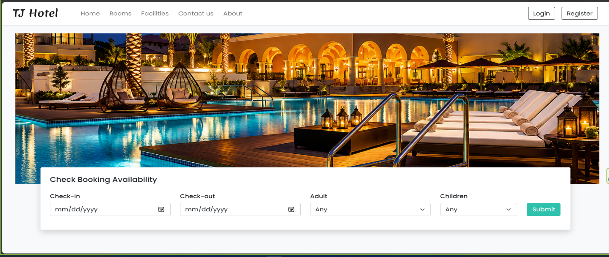

---

## 📝 Registration Page

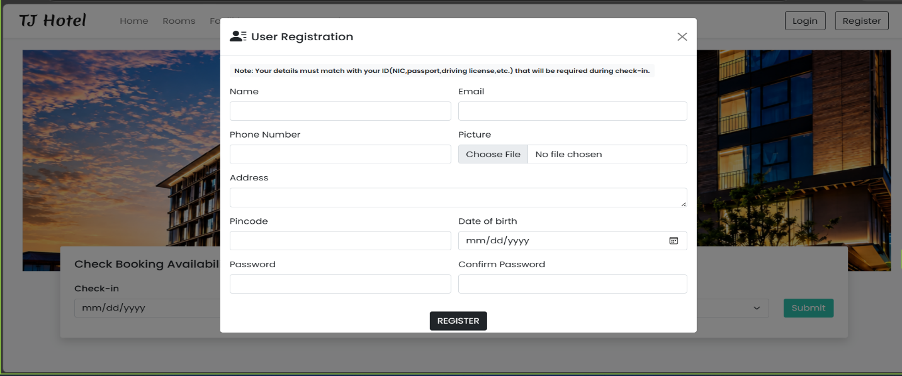

---

## 🔐 Login Page

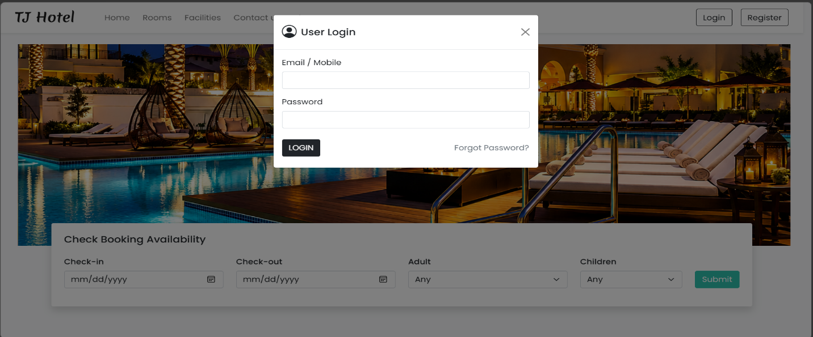

---

## 🏨 Room Listing

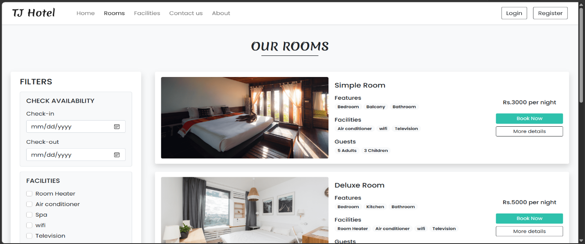

---

## 🛏️ Room Details

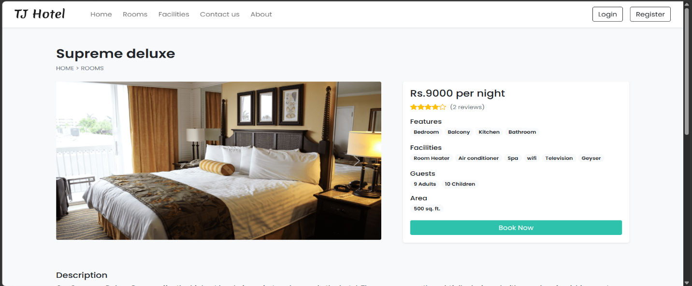

---

## 📅 Booking Form

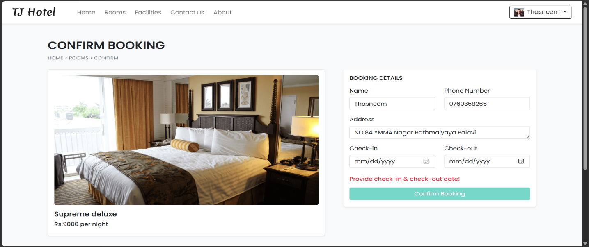

---

## 📋 My Bookings

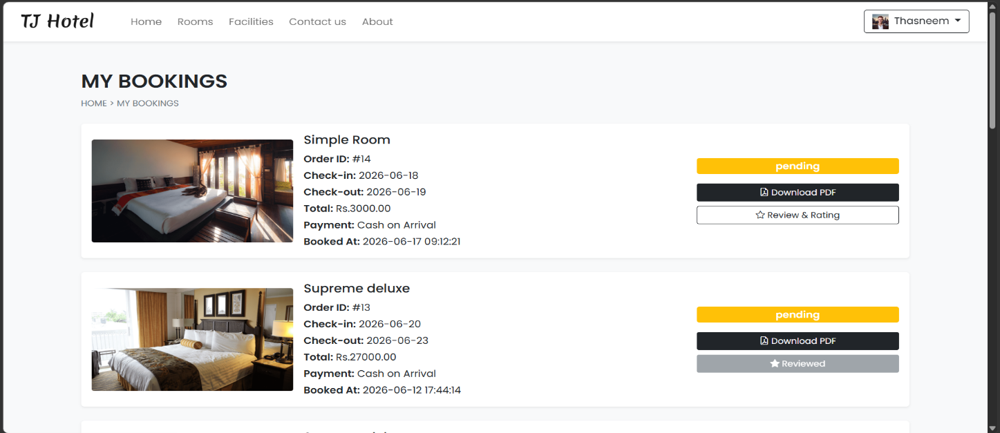

---

## ⭐ Reviews Page

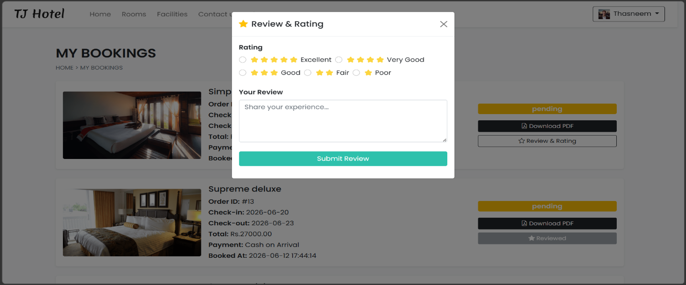

---

## 📊 Admin Dashboard

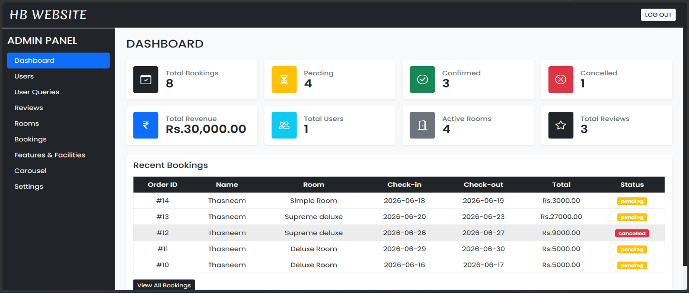

---

## 📋 Bookings

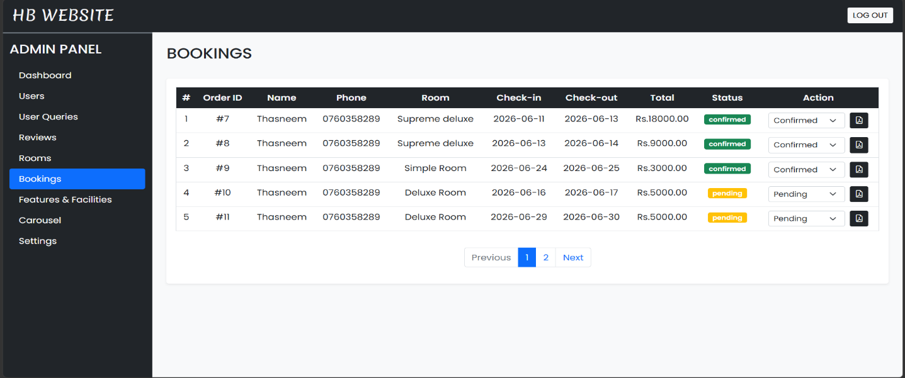

---

## ⭐ Reviews

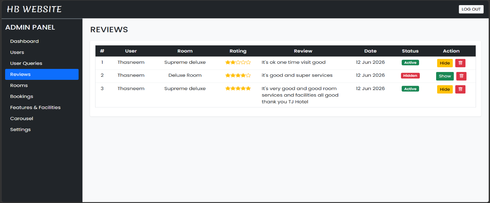

## 🔒 Security

The application includes several security-related features:

* User authentication
* Email verification
* Admin authentication
* Protected admin dashboard
* Input validation
* Database query security
* Secure handling of API credentials

> **Important:** API keys, passwords, database credentials, and other sensitive information should never be committed to a public GitHub repository.

---

## 🚀 Future Improvements

* 💳 Online payment gateway integration
* 📱 Mobile application
* 🔔 SMS booking notifications
* 📧 Automated booking reminder emails
* 🗺️ Google Maps integration
* 🌐 Multi-language support
* 📊 Advanced analytics and reporting
* 💰 Advanced revenue management
* ☁️ Cloud deployment
* 🔔 Real-time booking notifications

---

## 📌 Project Status

**Development Status: Completed / Academic Project**

This project was developed as a final-year HND Information Technology project to demonstrate the implementation of a real-world hotel booking system using PHP, MySQL, JavaScript, AJAX, Bootstrap, SendGrid API, and mPDF.

---

## 👨‍💻 Author

**Mohamed Thasneem**

HND in Information Technology
Advanced Technological Institute (ATI), Vavuniya
Sri Lanka

---

## 📄 License

This project was developed for academic and educational purposes as part of an HND Information Technology final-year project.
